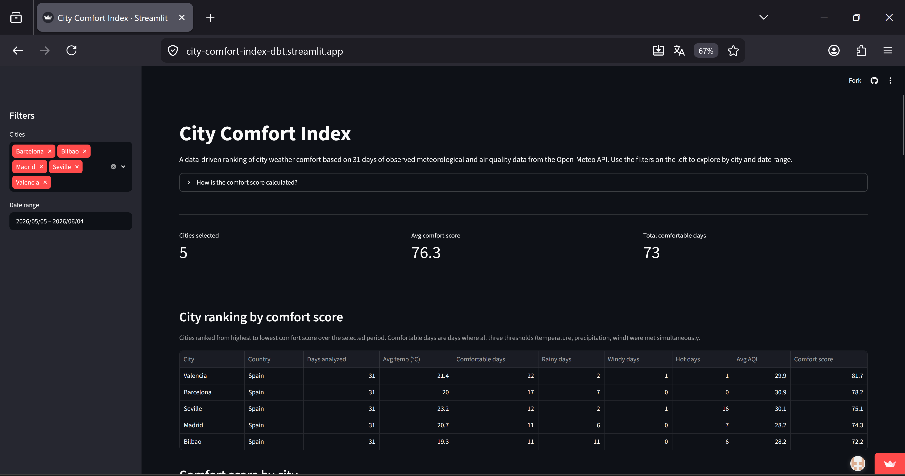
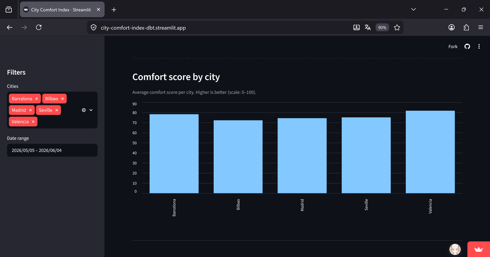
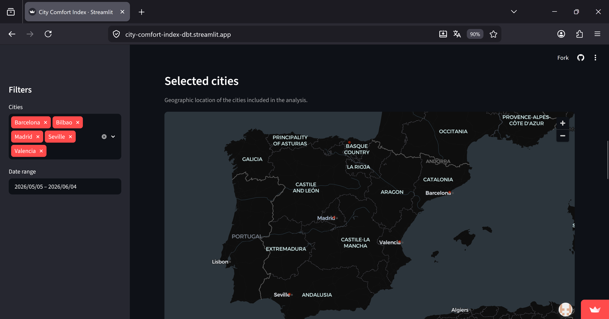
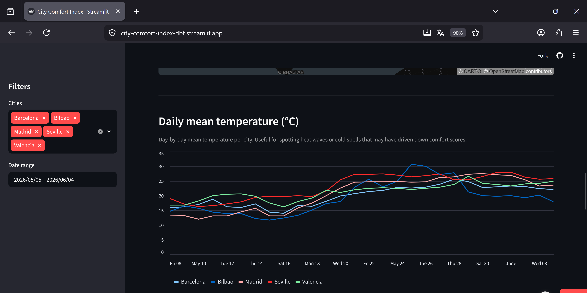
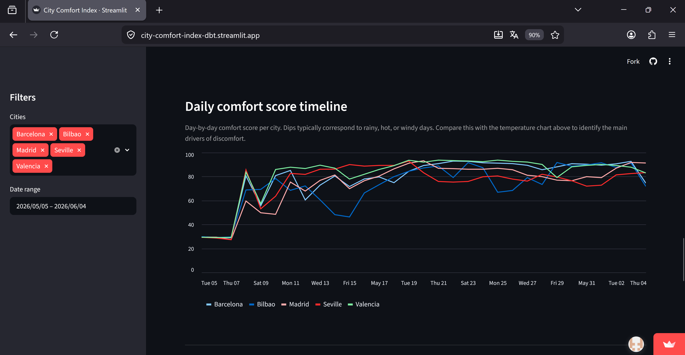
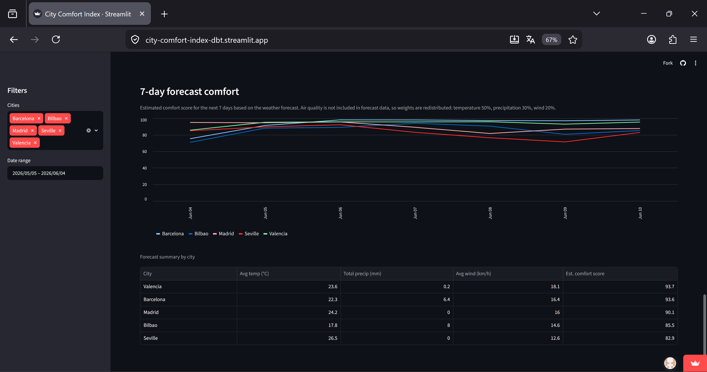

# Open-Meteo City Comfort Index

An end-to-end analytics engineering project: extract weather, forecast, and air
quality data from the [Open-Meteo API](https://open-meteo.com/), model it with
dbt on DuckDB, and explore it in a Streamlit dashboard.

**Dashboard theme:** City Comfort Index — which cities had the most comfortable
weather over the selected period?

## Dashboard screenshots








## Stack

- **DuckDB** — local warehouse (`weather.duckdb`, rebuilt from the committed raw CSVs)
- **dbt Core** (`dbt-duckdb`) — staging → intermediate → marts
- **Streamlit** — dashboard reading from the final marts
- **Python** — extraction + load scripts

## Quickstart

```bash
# 1. Environment
uv sync                      # or: pip install -e .
source .venv/bin/activate

# 2. How do I run the extraction?  (writes data/raw/open_meteo/*.csv)
uv run python scripts/extract_open_meteo.py

# 3. How do I load the data?       (CSVs -> weather.duckdb raw tables)
uv run python scripts/load_duckdb.py

# 4. How do I run dbt?
dbt deps
dbt build                    # run + test all models

# 5. How do I launch the dashboard?
streamlit run streamlit_app/app.py

# Or visit the live deployed dashboard:
# https://city-comfort-index-dbt.streamlit.app
```

## What final models power the dashboard?

- **`fct_city_weather_day`** — fact table, one row per city per day.
- **`mart_city_comfort_summary`** — one row per city, the comfort ranking.
- **`dim_location`** — city dimension (used for the map and city names).

## Modeling layers

```
sources (raw_* CSVs in DuckDB)
  └─ staging/        stg_locations, stg_weather_daily, stg_forecast_daily, stg_air_quality_hourly
       └─ intermediate/  int_air_quality_daily, int_weather_flags, int_city_day_weather
            └─ marts/    dim_location, fct_city_weather_day, mart_city_comfort_summary
```

- **Staging** — one model per raw source; rename to snake_case, cast types, keep the source grain.
- **Intermediate** — daily air-quality rollup, per-day comfort flags, and a combined city-day table.
- **Marts** — a conformed `dim_location`, a `fct_city_weather_day` fact (one row per city per day),
  and `mart_city_comfort_summary` (one row per city) that ranks cities by comfort.

### Comfort score definition

Each day gets a weighted **comfort score (0–100)** built from four 0–100 sub-scores
(in `models/intermediate/int_city_day_weather.sql`):

| Component | Weight | Best when |
|---|---|---|
| Temperature | 40% | mean temp near 22 °C; extra heat penalty when daily max > 30 °C |
| Precipitation | 25% | dry (0 mm) |
| Air quality | 20% | low European AQI |
| Wind | 15% | calm (≤ 15 km/h) |

```
daily comfort_score = 0.40*temp + 0.25*precip + 0.20*aqi + 0.15*wind
```

If a day has no air-quality reading, the remaining weights are renormalised so the
day isn't penalised. The **City Comfort Index** in `mart_city_comfort_summary` is the
average daily comfort score per city.

Supporting flags (`is_comfortable`, `is_rainy`, `is_hot`, `is_windy`) live in
`models/intermediate/int_weather_flags.sql`. A day is *comfortable* when mean temp is
18–26 °C, precipitation < 1 mm, and max wind < 25 km/h.

## Tests

`dbt build` runs tests covering: unique + not-null primary keys, unique
city-day grain, foreign-key relationships to `dim_location`, not-null dates and
location keys, and a 0–100 range check on `comfort_score`.

## Reproducibility note

The raw CSVs in `data/raw/open_meteo/` are committed so the project rebuilds
identically. `weather.duckdb` is committed to the repository and can also be
regenerated from the CSVs by running `scripts/load_duckdb.py`.

See `ASSIGNMENT.md` for the original brief.
